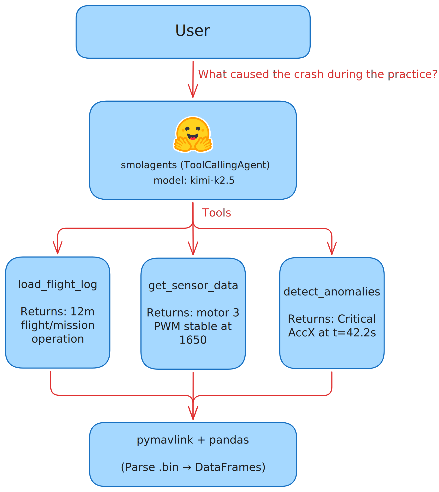

# AURA — Agentic Understanding of Robot Anomalies

An LLM-powered system that investigates ArduPilot flight logs through conversational analysis.

## Architecture



The LLM never sees raw numbers. Tools translate telemetry → English. The LLM reads English and reasons.

## Tools

| Tool | Purpose |
|------|---------|
| `load_flight_log` | Parse .bin file, return flight summary |
| `get_sensor_data` | Get channel statistics in time window |
| `detect_anomalies` | Find anomalies using Isolation Forest |
| `correlate_channels` | Find relationships between sensors |
| `plot_data` | Generate matplotlib plots |

## Setup

```bash
# Create environment with uv
uv venv
source .venv/bin/activate

# Install dependencies
uv pip install -e .

# Set OpenRouter API key
export OPENROUTER_API_KEY=sk-or-...
```

## Usage

```bash
# Run CLI chat
uv run aura

# Or with a specific model
uv run aura openrouter/anthropic/claude-3.5-sonnet
```

## Demo Scenario

1. **User**: "Give me an overview of this flight"
   → Agent calls `load_flight_log`, summarizes duration, channels, modes

2. **User**: "Anything unusual happen?"
   → Agent calls `detect_anomalies` on motors, gyros, reports findings

3. **User**: "What caused the altitude loss?"
   → Agent calls `get_sensor_data(Motor3)`, `correlate_channels(Motor3, Alt)`, synthesizes explanation

4. **User**: "Could this have been predicted?"
   → Agent examines pre-failure data for warning signs

## Project Structure

```
aura/
├── src/aura/
│   ├── __init__.py
│   ├── parser.py      # pymavlink log parsing
│   ├── tools.py       # @tool decorated analysis functions
│   ├── agent.py       # smolagents setup
│   └── main.py        # CLI chat interface
├── logs/              # Sample flight logs
├── plots/             # Generated plots
├── pyproject.toml
└── README.md
```

## Sample Data

Download test logs from:
- [dronekit-la-testdata](https://github.com/dronekit/dronekit-la-testdata)
- [ArduPilot Forums](https://discuss.ardupilot.org/) (search for crash logs)
